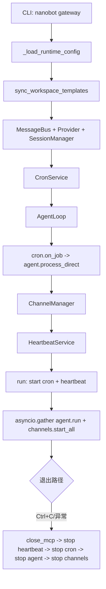

# gateway 入口：daemon 生命周期与组件编排

## 起点与终点

- 起点：执行 `nanobot gateway`
- 终点：进入长驻并发运行，直到收到中断或异常触发关闭序列

## 入口职责

- 加载运行期配置并解析端口
- 创建 AgentLoop、ChannelManager、CronService、HeartbeatService
- 绑定 cron 与 heartbeat 回调到 agent 主执行链
- 长驻运行并在退出时按顺序回收资源

源码锚点：

- gateway 入口：[commands.py:L488-L675](file:///Users/bowhead/nanobot/nanobot/cli/commands.py#L488-L675)

## 生命周期流程图

## daemon 运行时关键点

- 这是“多服务聚合进程”，并非单纯 API 服务
- `agent.run()` 与 `channels.start_all()` 并发常驻
- cron 和 heartbeat 都通过回调把任务送回 `agent.process_direct(...)`
- 关闭顺序固定，保证先停外联和调度，再回收 agent 与 channels

源码锚点：

- 并发运行：[commands.py:L654-L661](file:///Users/bowhead/nanobot/nanobot/cli/commands.py#L654-L661)
- cron 回调桥接：[commands.py:L540-L586](file:///Users/bowhead/nanobot/nanobot/cli/commands.py#L540-L586)
- heartbeat 回调桥接：[commands.py:L607-L641](file:///Users/bowhead/nanobot/nanobot/cli/commands.py#L607-L641)
- 关闭序列：[commands.py:L668-L674](file:///Users/bowhead/nanobot/nanobot/cli/commands.py#L668-L674)

## 运维关注点

- 配置变更后是否需重启：端口、渠道启用、模型、工具注册项通常需要重启
- heartbeat 与 cron 的任务内容通常可动态生效
- 想快速恢复服务可用 `/restart`（会话内）或直接重启进程
