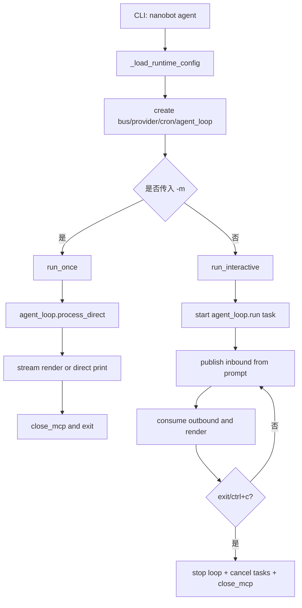

# agent 入口：单次执行与交互会话模式

## 起点与终点

- 起点：执行 `nanobot agent`
- 终点：单次模式下返回一次响应即退出；交互模式下持续收发直到用户退出

## 两种运行模式

- 单次模式：`nanobot agent -m "..."`，一次请求一次回复
- 交互模式：`nanobot agent`，通过 CLI 循环读入并经消息总线路由

源码锚点：

- agent 入口：[commands.py:L685-L898](file:///Users/bowhead/nanobot/nanobot/cli/commands.py#L685-L898)

## 模式分流图



## 交互模式执行链（简化）

```mermaid
sequenceDiagram
    participant U as User
    participant CLI as PromptSession
    participant Bus as MessageBus
    participant Loop as AgentLoop
    participant LLM as Provider

    U->>CLI: 输入文本
    CLI->>Bus: publish_inbound
    Bus->>Loop: consume_inbound
    Loop->>LLM: chat/tool迭代
    Loop->>Bus: publish_outbound(流式delta或最终结果)
    Bus->>CLI: consume_outbound
    CLI->>U: 渲染输出
```

## 运维/开发关注点

- 单次模式便于脚本化巡检与 CI 验证
- 交互模式便于人工排障，支持流式输出与进度提示
- 会话中可直接触发 slash 命令（如 `/status`、`/restart`）

源码锚点：

- 单次分支：[commands.py:L744-L763](file:///Users/bowhead/nanobot/nanobot/cli/commands.py#L744-L763)
- 交互分支：[commands.py:L765-L898](file:///Users/bowhead/nanobot/nanobot/cli/commands.py#L765-L898)
