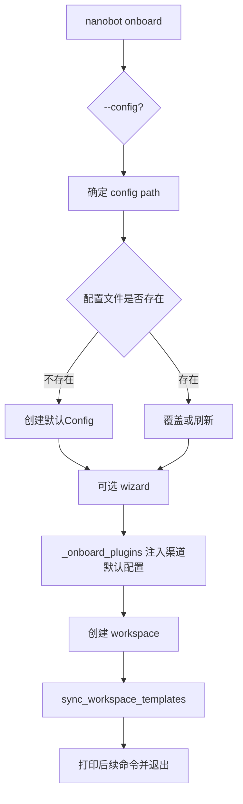

# 短命令入口：onboard、status、channels、plugins、provider

## 起点与终点

- 起点：执行一次性运维命令（初始化、巡检、登录、插件检查）
- 终点：完成动作后立即退出，不进入长驻循环

## 命令分组与用途

| 命令 | 生命周期 | 主要用途 |
|---|---|---|
| `nanobot onboard` | 短时 | 初始化/刷新配置与工作区模板 |
| `nanobot status` | 短时 | 快速体检配置、工作区、模型与凭据状态 |
| `nanobot channels status` | 短时 | 查看渠道启用状态 |
| `nanobot channels login` | 短时 | 执行桥接登录流程（二维码等） |
| `nanobot plugins list` | 短时 | 查看内置/插件渠道及其启用状态 |
| `nanobot provider login <name>` | 短时 | OAuth 认证登录 |

源码锚点：

- `onboard`：[commands.py:L250-L338](file:///Users/bowhead/nanobot/nanobot/cli/commands.py#L250-L338)
- `status`：[commands.py:L1079-L1113](file:///Users/bowhead/nanobot/nanobot/cli/commands.py#L1079-L1113)
- `channels status`：[commands.py:L910-L935](file:///Users/bowhead/nanobot/nanobot/cli/commands.py#L910-L935)
- `channels login`：[commands.py:L999-L1030](file:///Users/bowhead/nanobot/nanobot/cli/commands.py#L999-L1030)
- `plugins list`：[commands.py:L1040-L1071](file:///Users/bowhead/nanobot/nanobot/cli/commands.py#L1040-L1071)
- `provider login`：[commands.py:L1134-L1196](file:///Users/bowhead/nanobot/nanobot/cli/commands.py#L1134-L1196)

## `onboard` 流程图

## doctor 对位：当前诊断面

- 当前没有独立 `nanobot doctor` 命令
- 建议把诊断动作拆成三层：
  - 进程外静态：`nanobot status`
  - 渠道开关与注册：`nanobot channels status`、`nanobot plugins list`
  - 会话内动态：`/status`（见 05 文档）

## 运维建议

- 部署前先跑：`onboard` -> `status` -> `channels status`
- 配置 OAuth 提供商时，优先执行 `provider login`
- `channels login` 属于接入动作，成功后再由 `gateway` 长驻承接消息
