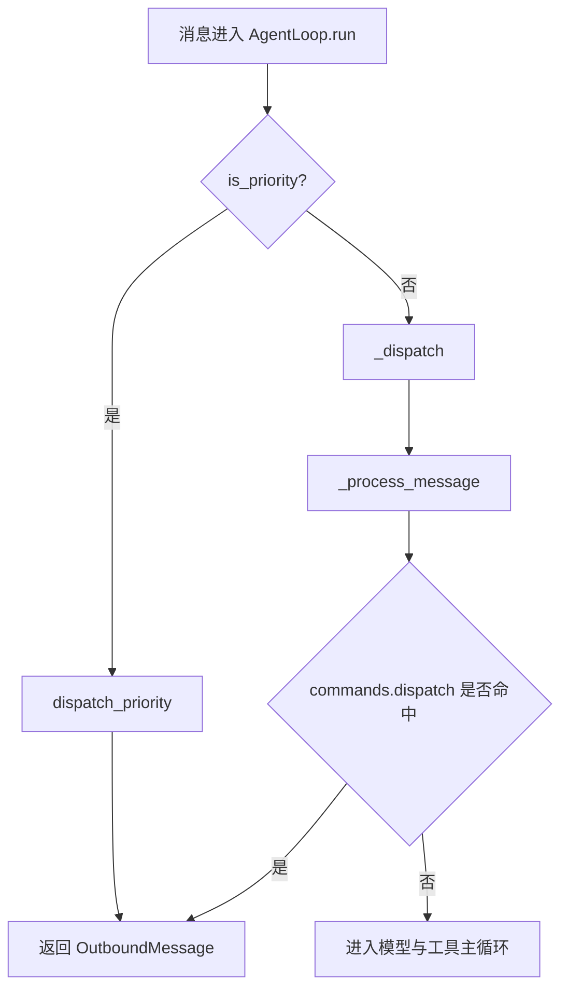
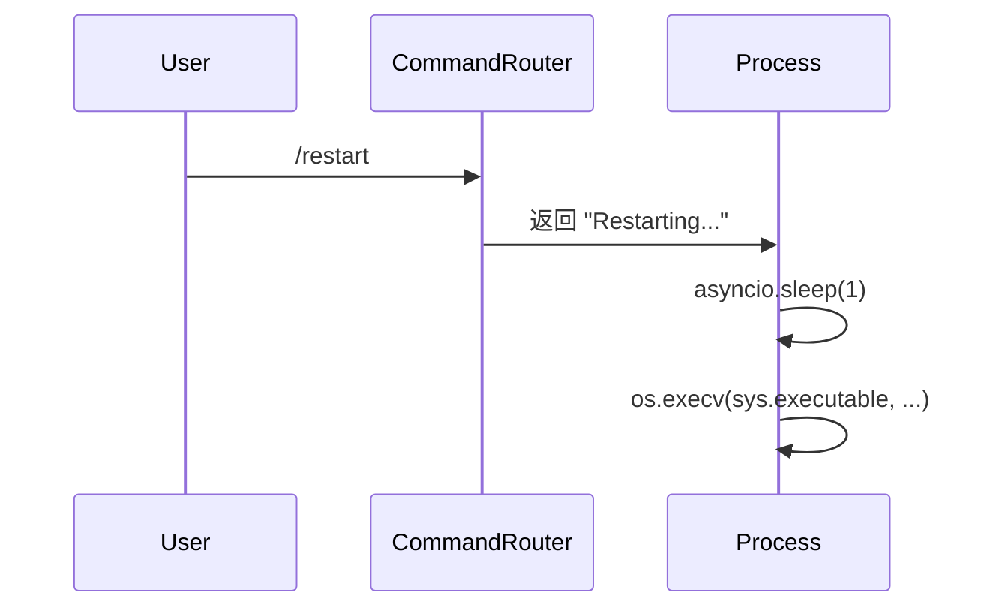

# 会话内入口：slash 命令执行面

## 起点与终点

- 起点：用户在会话内输入 `/...` 命令
- 终点：命令被优先路由处理，返回控制结果或状态信息

## 命令清单

| 命令 | 作用 | 影响范围 |
|---|---|---|
| `/stop` | 取消会话内活动任务与子代理任务 | 当前会话 |
| `/restart` | 原地重启当前进程 | 当前进程 |
| `/status` | 返回运行状态与上下文估算 | 当前会话 |
| `/new` | 清空并重建会话，旧消息转归档任务 | 当前会话 |
| `/help` | 输出可用命令列表 | 当前会话 |

源码锚点：

- 命令注册：[builtin.py:L103-L110](file:///Users/bowhead/nanobot/nanobot/command/builtin.py#L103-L110)
- 命令实现：[builtin.py:L15-L100](file:///Users/bowhead/nanobot/nanobot/command/builtin.py#L15-L100)

## slash 路由流程图

源码锚点：

- 优先命令短路：[loop.py:L328-L334](file:///Users/bowhead/nanobot/nanobot/agent/loop.py#L328-L334)
- 常规命令分发：[loop.py:L438-L443](file:///Users/bowhead/nanobot/nanobot/agent/loop.py#L438-L443)

## `/restart` 语义图

源码锚点：

- `/restart` 实现：[builtin.py:L32-L41](file:///Users/bowhead/nanobot/nanobot/command/builtin.py#L32-L41)

## 运维提示

- `/restart` 适合在线快速重载当前进程，不替代进程守护能力
- 对于长驻部署，仍建议配合 systemd/容器策略管理自动拉起
