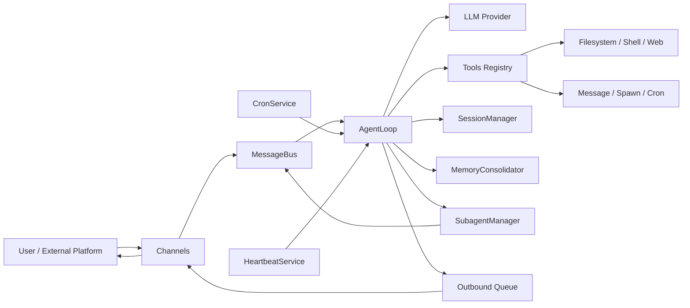
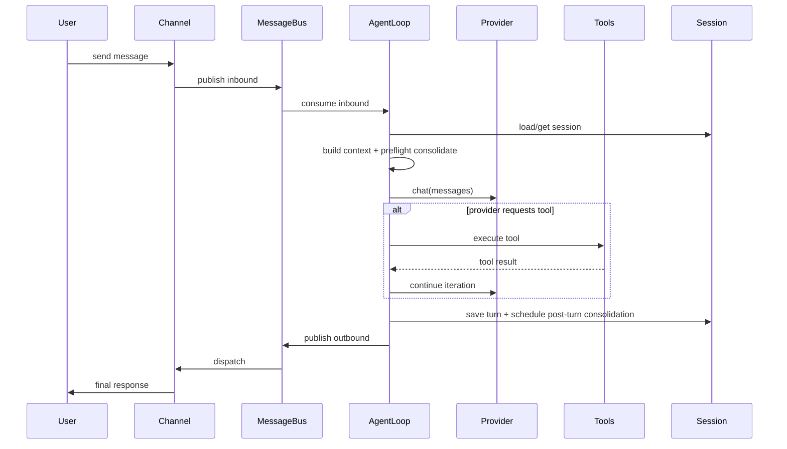

# 00-总览

本目录是 NanoBot 文档体系的入口页，目标是先建立“整体心智模型”，再进入各专题细节。

## NanoBot 在做什么

- 对外：统一承接多渠道消息（CLI / Telegram / Matrix / WeCom 等）
- 对内：通过 AgentLoop 组织“模型推理 ↔ 工具执行”闭环
- 对运行期：提供 cron、heartbeat、subagent 等后台能力
- 对长期运行：通过 session 与 memory 机制维持上下文一致性

## 系统全景图

## 主链路时序图（单条消息）

## 目录阅读地图

- 主执行流程：[_docs/10-main-flow](../10-main-flow/README.md)
- Agent 核心机制：[_docs/20-agent-core](../20-agent-core/README.md)
- 工具与扩展：[_docs/30-tools-and-extension](../30-tools-and-extension/README.md)
- 渠道层（待持续补全）：[_docs/40-channel-layer](../40-channel-layer/README.md)
- 运行时服务：[_docs/50-runtime-services](../50-runtime-services/README.md)
- 配置与多实例：[_docs/60-config-and-multi-instance](../60-config-and-multi-instance/README.md)
- 跨模块专题：[_docs/70-special-topics](../70-special-topics/README.md)

## 推荐阅读顺序

1. 先读本页两张图，建立角色与边界
2. 再读 10/20，理解请求主链路和核心状态变化
3. 再读 30/50/60，理解能力扩展与运行期行为
4. 最后读 70，按生产问题类型做逆向排障

## 术语表

| 术语 | 含义 | 关键位置 |
|---|---|---|
| InboundMessage | 渠道标准化后的入站消息模型 | `nanobot/bus/events.py` |
| OutboundMessage | 系统发送给外部渠道的出站消息模型 | `nanobot/bus/events.py` |
| AgentLoop | 核心执行引擎，负责推理、工具迭代与回写 | `nanobot/agent/loop.py` |
| ToolRegistry | 工具注册与调用分发中心 | `nanobot/agent/tools/registry.py` |
| Session | 会话历史与切片视图承载对象 | `nanobot/session/manager.py` |
| MemoryConsolidator | 长会话压缩归纳策略执行器 | `nanobot/agent/memory.py` |
| CronService | 延迟/周期任务调度服务 | `nanobot/cron/service.py` |
| HeartbeatService | 周期决策与主动触发服务 | `nanobot/heartbeat/service.py` |
| SubagentManager | 后台子代理任务管理器 | `nanobot/agent/subagent.py` |
