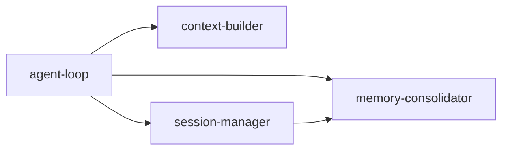

# 20-agent-core

本目录聚焦 NanoBot 的中心核心：Agent 的调度、上下文、记忆与会话。

## 核心协作图

## 分析范围

- `agent-loop`：主循环、工具调用迭代、命令控制、并发与中断
- `context-builder`：系统提示词拼装、运行时上下文注入、多模态输入封装
- `memory-consolidator`：会话压缩归纳、历史沉淀、降级策略
- `session-manager`：JSONL 持久化、历史切片、工具调用边界合法性

## 深挖顺序

- 先看 `agent-loop`，建立端到端时序
- 再看 `context-builder`，明确输入如何变成可喂给模型的消息链
- 再看 `session-manager`，理解长期会话如何保持结构稳定
- 最后看 `memory-consolidator`，理解上下文超长时如何收敛

## 统一分析维度

- 角色职责：该模块在主链路中负责什么
- 数据输入：依赖哪些对象与字段
- 状态变化：会更新哪些内存态与持久化状态
- 边界条件：异常、超限、取消时如何处理
- 与其他模块关系：调用方向与耦合点

## 文档产出规模

- `agent-loop`：6 篇
- `context-builder`：4 篇
- `memory-consolidator`：5 篇
- `session-manager`：4 篇
- 合计：19 篇主题文档（不含各目录 README）

## 产出原则

- 先完成每个子目录的 `01`，快速建立骨架
- 再补每个子目录中最容易混淆的机制文档
- 最后统一补“异常与边界”类文档，保证完整性
