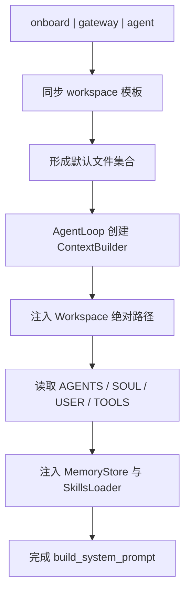

# bootstrap 指令与 workspace 文件系统约定

## 起点与终点

- 起点：CLI 入口确定 workspace，并触发模板同步
- 终点：Agent 在 `build_system_prompt()` 中拿到“路径边界 + MD 约定 + memory/skills 能力”

## 结论先行

- 你关心的这套“Agent 暴露约定”已经在代码里落地，而且是以 workspace 文件系统为中心
- 约定并不是散落在代码常量里，而是由 `AGENTS.md/SOUL.md/USER.md/TOOLS.md` 驱动
- 这 4 个文件会被直接注入 system prompt，等价于“项目可配置的 Agent 行为合同”

## 设计总流程

## workspace 路径如何进入模型

`ContextBuilder._get_identity()` 会把 workspace 绝对路径写进 `## Workspace`，并附带 memory 与 skills 路径。  
模型因此天然具备“在哪里读写”的定位，不需要猜目录。

源码锚点：

- Workspace 注入：[context.py:L56-L87](file:///Users/bowhead/nanobot/nanobot/agent/context.py#L56-L87)

## bootstrap MD 是如何加载的

固定加载顺序为：

1. `AGENTS.md`
2. `SOUL.md`
3. `USER.md`
4. `TOOLS.md`

存在才加载，不存在则跳过；内容按原文拼接进 system prompt。  
这意味着项目可以通过改这些 MD 来约束 Agent 的风格、偏好、工具边界和执行习惯。

源码锚点：

- bootstrap 清单常量：[context.py:L19-L20](file:///Users/bowhead/nanobot/nanobot/agent/context.py#L19-L20)
- 加载实现：[context.py:L109-L119](file:///Users/bowhead/nanobot/nanobot/agent/context.py#L109-L119)

## 这些 MD 从哪里来

模板同步由 `sync_workspace_templates(...)` 负责，策略是“仅补缺，不覆盖已有文件”。

- 首次初始化会创建缺失的 `.md` 模板
- 已存在文件保留用户修改
- 同时确保 `memory/MEMORY.md`、`memory/HISTORY.md` 与 `skills/` 目录存在

源码锚点：

- 同步实现（仅补缺）：[helpers.py:L259-L289](file:///Users/bowhead/nanobot/nanobot/utils/helpers.py#L259-L289)
- onboard 调用：[commands.py:L314-L321](file:///Users/bowhead/nanobot/nanobot/cli/commands.py#L314-L321)
- gateway 调用：[commands.py:L509-L514](file:///Users/bowhead/nanobot/nanobot/cli/commands.py#L509-L514)
- agent 调用：[commands.py:L702-L704](file:///Users/bowhead/nanobot/nanobot/cli/commands.py#L702-L704)

相关测试：

- 不覆盖已有 `AGENTS.md`：[test_onboard_logic.py:L319-L329](file:///Users/bowhead/nanobot/tests/test_onboard_logic.py#L319-L329)
- onboard 后模板存在：[test_commands.py:L59-L75](file:///Users/bowhead/nanobot/tests/test_commands.py#L59-L75)

## 哪些 MD 会直接“暴露给 Agent”

- 会进 system prompt：`AGENTS.md`、`SOUL.md`、`USER.md`、`TOOLS.md`
- 不会进 bootstrap 注入但会被运行时服务读取：`HEARTBEAT.md`

`HEARTBEAT.md` 由 HeartbeatService 在 tick 时实时读取，用于决定是否触发执行，不属于 `ContextBuilder.BOOTSTRAP_FILES`。

源码锚点：

- heartbeat 文件路径与读取：[service.py:L73-L83](file:///Users/bowhead/nanobot/nanobot/heartbeat/service.py#L73-L83)
- tick 时读取并判空：[service.py:L143-L150](file:///Users/bowhead/nanobot/nanobot/heartbeat/service.py#L143-L150)

## workspace MD 详细契约（拆分阅读）

每个 MD 的 Do / Do Not、模板样板、约束强度已拆到独立文档：

- [06-workspace-md-contracts-dos-donts-and-templates.md](file:///Users/bowhead/nanobot/_docs/20-agent-core/context-builder/06-workspace-md-contracts-dos-donts-and-templates.md)

## 边界说明：不是“任意目录随便写”

- workspace 是默认主边界
- 是否强制限制到 workspace，受 `tools.restrict_to_workspace` 控制
- 读工具可按能力扩展额外允许目录，但写工具仍受更严格边界

源码锚点：

- 配置项定义：[schema.py:L139-L146](file:///Users/bowhead/nanobot/nanobot/config/schema.py#L139-L146)
- 边界行为测试：[test_filesystem_tools.py:L267-L377](file:///Users/bowhead/nanobot/tests/test_filesystem_tools.py#L267-L377)
