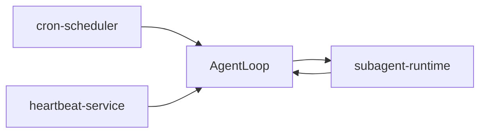

# 50-运行时服务

本目录聚焦 NanoBot 在“非即时交互”阶段的执行体系：定时调度、周期唤醒、后台任务并发。

## 运行时服务关系图

## 分析范围

- `cron-scheduler`：`CronService` 的持久化调度与执行语义
- `heartbeat-service`：`HeartbeatService` 的周期决策与触发链路
- `subagent-runtime`：`spawn` 与 `SubagentManager` 的后台任务闭环

## 深挖顺序

- 先看 `cron-scheduler`，建立“何时执行”的调度模型
- 再看 `heartbeat-service`，理解“何时主动唤醒”的决策模型
- 最后看 `subagent-runtime`，理解“如何并发执行并回传结果”

## 阅读路径

- 快速入门：先读每个子目录 `01`，快速建立运行时全景
- 新增定时任务：优先看 `cron-scheduler/02` 与 `04`
- 周期巡检或提醒：优先看 `heartbeat-service/02` 与 `03`
- 后台并行任务：优先看 `subagent-runtime/01` 与 `03`
- 排障入口：按“触发源 -> 状态变化 -> 回传路径 -> 边界策略”逆向定位

## 故障定位速查

| 现象 | 核心文件 | 关键函数 |
|---|---|---|
| 任务到点没触发 | [cron/service.py](../../nanobot/cron/service.py) | [_compute_next_run](../../nanobot/cron/service.py#L20-L46), [_arm_timer](../../nanobot/cron/service.py#L228-L245) |
| job 被创建但没有回消息 | [agent/tools/cron.py](../../nanobot/agent/tools/cron.py), [cli/commands.py](../../nanobot/cli/commands.py) | [CronTool.execute](../../nanobot/agent/tools/cron.py#L74-L93), [_pick_heartbeat_target](../../nanobot/cli/commands.py#L595-L609) |
| HEARTBEAT 有内容但长期不执行 | [heartbeat/service.py](../../nanobot/heartbeat/service.py) | [_decide](../../nanobot/heartbeat/service.py#L85-L109), [_run_loop](../../nanobot/heartbeat/service.py#L131-L141) |
| heartbeat 执行了但用户侧无通知 | [cli/commands.py](../../nanobot/cli/commands.py), [heartbeat/service.py](../../nanobot/heartbeat/service.py) | [_pick_heartbeat_target](../../nanobot/cli/commands.py#L595-L609), [on_heartbeat_notify](../../nanobot/cli/commands.py#L627-L633) |
| spawn 后只看到“已启动”无后续 | [agent/subagent.py](../../nanobot/agent/subagent.py) | [_run_subagent](../../nanobot/agent/subagent.py#L82-L166), [_announce_result](../../nanobot/agent/subagent.py#L168-L198) |
| `/stop` 后后台任务仍未停干净 | [agent/subagent.py](../../nanobot/agent/subagent.py), [agent/loop.py](../../nanobot/agent/loop.py) | [cancel_by_session](../../nanobot/agent/subagent.py#L223-L230), [_handle_stop](../../nanobot/agent/loop.py#L288-L317) |

## 统一分析维度

- 触发源：由谁触发（时间、周期、工具调用）
- 状态机：运行中状态如何变化、如何落盘
- 回传路径：结果如何进入主链路或对外发送
- 边界策略：重入、递归、异常、取消如何处理

## 文档产出规模

- `cron-scheduler`：4 篇
- `heartbeat-service`：4 篇
- `subagent-runtime`：4 篇
- 合计：12 篇主题文档（不含各目录 README）

## 12 篇落地清单（对照）

### cron-scheduler

- `cron-scheduler/01-cron-store-model-and-persistence.md`
- `cron-scheduler/02-schedule-computation-and-timer-arm.md`
- `cron-scheduler/03-due-job-execution-and-run-history.md`
- `cron-scheduler/04-cron-tool-bridge-and-recursion-guard.md`

### heartbeat-service

- `heartbeat-service/01-heartbeat-loop-and-lifecycle.md`
- `heartbeat-service/02-decision-tool-contract-and-prompt-source.md`
- `heartbeat-service/03-execute-notify-routing-and-channel-target.md`
- `heartbeat-service/04-error-handling-and-disable-semantics.md`

### subagent-runtime

- `subagent-runtime/01-spawn-tool-context-and-task-hand-off.md`
- `subagent-runtime/02-subagent-loop-and-tool-sandbox.md`
- `subagent-runtime/03-system-channel-callback-and-result-delivery.md`
- `subagent-runtime/04-cancellation-timeout-and-failure-fallback.md`
