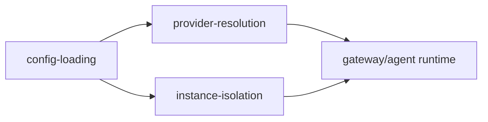

# 60-配置与多实例

本目录聚焦配置装载、Provider 解析与实例隔离三条主链路，解释 NanoBot 如何在同机多实例场景下稳定运行且互不干扰。

## 配置与实例关系图

## 核心主题

- 配置从 CLI 入口到 schema 验证、迁移与保存的完整生命周期
- model/provider/api_key/api_base 如何决定最终 Provider 路由
- 实例级目录与全局共享目录如何划边界并保障多实例隔离

## 阅读路径

- `config-loading/`：先看配置如何被加载、刷新、向后兼容
- `instance-isolation/`：再看路径分层和实例级状态隔离
- `provider-resolution/`：最后看 Provider 自动匹配与运行时实例化

## 子目录

- `config-loading/`：配置入口、load/save、迁移与 onboard 注入
- `provider-resolution/`：schema 匹配策略、registry 优先级、LiteLLM 网关路由
- `instance-isolation/`：data/workspace/sessions/media/cron 的实例边界

## 故障定位速查

| 现象 | 核心文件 | 关键函数 |
|---|---|---|
| `--config` 指定后仍读错配置 | [commands.py](../../nanobot/cli/commands.py) | [_load_runtime_config](../../nanobot/cli/commands.py#L451-L468), [set_config_path](../../nanobot/config/loader.py#L15-L19) |
| 配置字段更新后未生效 | [loader.py](../../nanobot/config/loader.py) | [load_config](../../nanobot/config/loader.py#L28-L50), [_migrate_config](../../nanobot/config/loader.py#L70-L77) |
| 两个实例出现数据串写 | [paths.py](../../nanobot/config/paths.py) | [get_data_dir](../../nanobot/config/paths.py#L11-L14), [get_runtime_subdir](../../nanobot/config/paths.py#L16-L19) |
| 模型命中到错误 provider | [schema.py](../../nanobot/config/schema.py) | [_match_provider](../../nanobot/config/schema.py#L160-L220), [get_api_base](../../nanobot/config/schema.py#L237-L251) |
| gateway/local 路由行为异常 | [litellm_provider.py](../../nanobot/providers/litellm_provider.py) | [__init__](../../nanobot/providers/litellm_provider.py#L36-L66), [_resolve_model](../../nanobot/providers/litellm_provider.py#L91-L109) |
