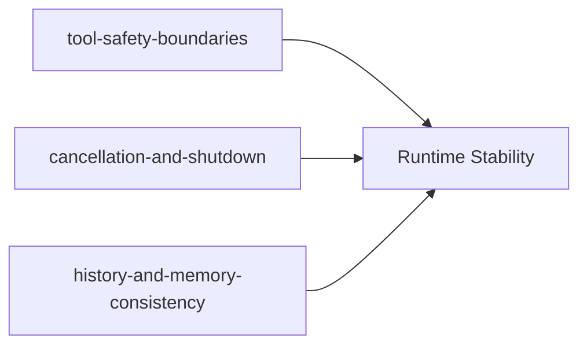

# 70-专题

本目录聚焦跨模块机制，不再按单一链路拆分，而是按“线上最常见问题类型”组织。

## 专题覆盖关系图

## 选题原则

- 只收纳横跨多个模块、单看某一目录无法讲清的问题
- 优先覆盖线上高频风险：副作用边界、停机与取消、一致性退化
- 每个子目录都要给出“故障现象 -> 定位抓手 -> 关键源码”

## 子目录

- `tool-safety-boundaries/`：工具能力与副作用边界
- `cancellation-and-shutdown/`：取消语义、后台任务回收、停机顺序
- `history-and-memory-consistency/`：会话历史卫生、归纳边界与恢复语义

## 阅读路径

- 先看 `tool-safety-boundaries/`，建立“什么能做、做到哪一步算安全”
- 再看 `cancellation-and-shutdown/`，理解“中断与退出时如何不丢状态”
- 最后看 `history-and-memory-consistency/`，理解“长期运行后如何保持一致性”

## 安全深挖路径

- `tool-safety-boundaries/01`：先看能力闸门与参数校验，确认“能不能调用”
- `tool-safety-boundaries/02`：再看 `exec`，确认“命令是否会被拦截与限时”
- `tool-safety-boundaries/03`：再看 `web`，确认“外部内容如何降权、SSRF 如何阻断”
- `tool-safety-boundaries/04`：最后看副作用工具，确认“消息/子代理/调度如何防扩散”

## 故障定位速查

| 现象 | 核心文件 | 关键函数 |
|---|---|---|
| 工具执行后出现越权或副作用失控 | [shell.py](../../nanobot/agent/tools/shell.py), [web.py](../../nanobot/agent/tools/web.py), [cron.py](../../nanobot/agent/tools/cron.py) | [ExecTool.execute](../../nanobot/agent/tools/shell.py#L78-L143), [WebFetchTool.execute](../../nanobot/agent/tools/web.py#L234-L333), [CronTool.execute](../../nanobot/agent/tools/cron.py#L74-L199) |
| 外部用户疑似越权触发机器人动作 | [base.py](../../nanobot/channels/base.py), [whatsapp.py](../../nanobot/channels/whatsapp.py), [server.ts](../../bridge/src/server.ts) | [is_allowed](../../nanobot/channels/base.py#L79-L87), [WhatsAppChannel.start](../../nanobot/channels/whatsapp.py#L51-L87), [BridgeServer.start](../../bridge/src/server.ts#L27-L68) |
| `/stop` 后仍有后台任务继续跑 | [loop.py](../../nanobot/agent/loop.py), [subagent.py](../../nanobot/agent/subagent.py) | [_handle_stop](../../nanobot/agent/loop.py#L288-L302), [cancel_by_session](../../nanobot/agent/subagent.py#L223-L231) |
| 历史越来越乱、模型上下文失真 | [loop.py](../../nanobot/agent/loop.py), [manager.py](../../nanobot/session/manager.py), [memory.py](../../nanobot/agent/memory.py) | [_save_turn](../../nanobot/agent/loop.py#L468-L503), [Session.get_history](../../nanobot/session/manager.py#L69-L92), [maybe_consolidate_by_tokens](../../nanobot/agent/memory.py#L302-L357) |
